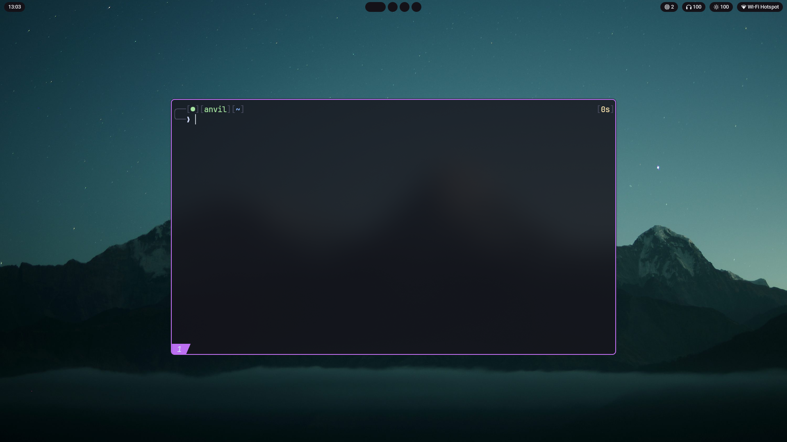
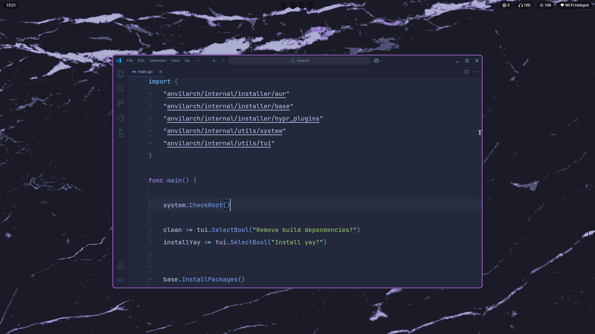
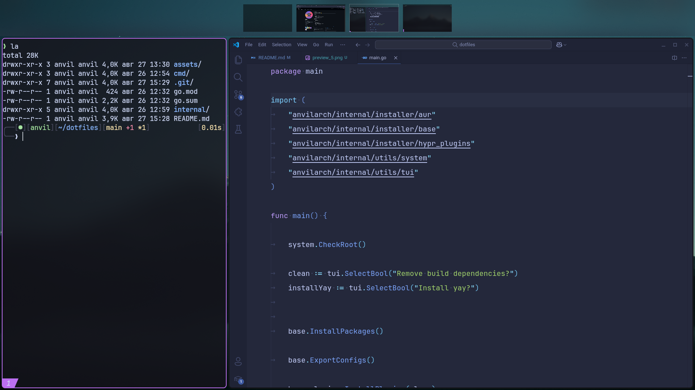
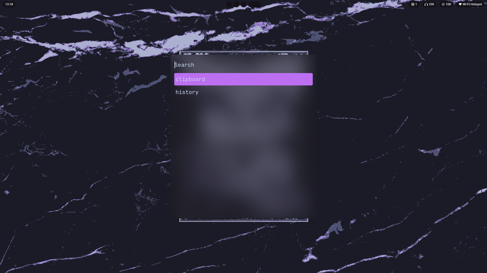

<h1 align="center">🌱 Sprout 🌱</h1>

_**Minimalist Arch Linux build designed as a starting point**_


## System Overview 🖥️

This section outlines the core components of the setup, designed for a lightweight and modern desktop experience. 🌟


-   **Operating System**: `Arch Linux`
-   **Window Manager**: `Hyprland`
-   **Bar**: `Waybar`
-   **Terminal**: `Kitty`
-   **Application Launcher**: `Rofi`
-   **Font**: `Roboto`
-   **Wallpaper Manager**: `swww`
-   **Shell**: `fish`


**Note**: This setup heavily relies on touchpad gestures for navigation and key bindings. Using it without a touchpad may be challenging due to gesture-based hotkeys. 🖐️

## Gallery 🖼️








## Features ✨

The setup is designed to be lightweight, customizable, and touchpad-friendly, with the following key features:

- 🎯 **Minimal bloat** — only the essential packages.  
- 🌱 **Flexible** — simple to extend with desktops, tools, and services.  
- 🔧 **Reconfigurable** — structure made for modification without barriers.  
- 📦 **Pure Arch** — no hidden magic, just standard mechanisms.
- 🖐️ **Touchpad Gesture Support**: Many hotkeys are replaced with intuitive touchpad gestures, optimized for laptops.
- 🪶 **Lightweight Build**: Minimal resource usage for a smooth experience.


## Installation 📦

This section provides a step-by-step guide. The installer can be used in a live Arch Linux environment or on an existing Arch Linux system. Below are the required packages and installation steps.

### Required Packages

Ensure the following packages are installed before running the installer. These are essential for the setup to function properly:

- `sudo`: For elevated privileges during installation.
- `curl` or `wget`: To download the installer from the repository.

### Installation Steps

1. **Download and Execute the Installer**  
   The user can download and execute the installer using one of the following methods:

   - Using `curl`:
     ```bash
     curl -L https://github.com/AnvilM/dotfiles/releases/latest/download/sprout-installer -o ./sprout-installer && chmod +x ./sprout-installer && sudo ./sprout-installer; rm -f ./sprout-installer
     ```

   - Using `wget`:
     ```bash
     wget -O ./sprout-installer https://github.com/AnvilM/dotfiles/releases/latest/download/sprout-installer && chmod +x ./sprout-installer && sudo ./sprout-installer; rm -f ./sprout-installer
     ```

2. **Configure the Installer**  
   During execution, the installer will prompt the user to select the desired configuration options. Choose the appropriate settings based on your preferences and system requirements.
<br>
3. **Verify Installation**  
   After the installer completes, verify the setup by running the following command:
   ```bash
   Hyprland
   ```
   If the installation was successful, Hyprland should start without errors. If issues occur, check the logs in `~/.hyprland.log` for debugging.

**Important**: The installer requires `sudo` privileges. Ensure the user account has sufficient permissions, especially in a live environment.


## Usage 🎮

Below are the key bindings and gestures for interacting with the system:

-   **Clipboard Manager**: `Ctrl + O`
-   **Wallpaper UI**: `Ctrl + L`
-   **Application Launcher**: `Ctrl + P`
-   **Screenshot**: `Ctrl + Print Screen`
-   **Close Current Window**: `Ctrl + Q`
-   **Maximize Window**: `Ctrl + D`
-   **Toggle Fullscreen**: `Ctrl + Shift + D`
-   **Switch Workspace**: Swipe three fingers left or right on the touchpad.
-   **View All Workspaces**: Swipe three fingers up on the touchpad. While viewing, you can drag and manage windows.

**Important**: The workspace navigation and management heavily rely on touchpad gestures, making a touchpad essential for the full experience. 🖐️